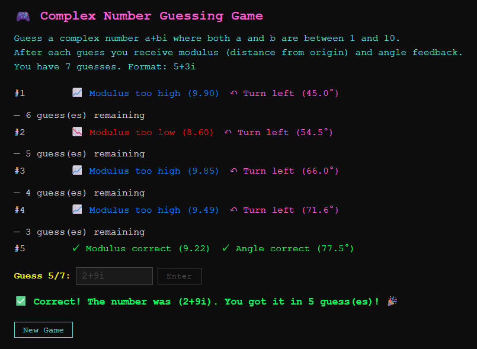

# Complex Number Guessing Game



A terminal-based complex number guessing game written in Go, also playable in the browser via WebAssembly.

Guess a complex number `a+bi` where both `a` and `b` are integers between 1 and 10. You have **7 attempts**. After each guess you receive feedback on the **modulus** (distance from the origin) and **angle** (argument) of your guess relative to the target.

## Gameplay

- Enter guesses in the format `5+3i`
- Each guess returns:
  - **Modulus feedback** — too high, too low, or correct
  - **Angle feedback** — turn left, turn right, or correct
- Invalid input does not consume a guess

## Development

### Prerequisites

- Go toolchain
- For WASM: `$(GOROOT)/misc/wasm/wasm_exec.js` (included via `make web-build`)

### Commands

| Command          | Description                                              |
|------------------|----------------------------------------------------------|
| `make build`     | Compile CLI binary to `bin/complex-number-guessing`     |
| `make run`       | Build and run the CLI                                    |
| `make test`      | Run all tests                                            |
| `make coverage`  | Generate HTML coverage report at `build/coverage.html`  |
| `make web-build` | Compile to WASM (`web/game.wasm`)                        |
| `make web-serve` | Build WASM and serve `web/` at `http://localhost:8080`   |
| `make clean`     | Remove build artifacts                                   |

## Architecture

| File | Description |
|------|-------------|
| [main.go](main.go) | CLI entry point (`!wasm` build tag); terminal I/O with `lipgloss` styling |
| [wasm_main.go](wasm_main.go) | WASM entry point (`js && wasm`); exposes `newGame` / `makeGuess` as JS globals |
| [game_logic.go](game_logic.go) | Shared pure logic: parsing, validation, modulus/angle checks |
| [web/](web/) | Vanilla JS + CSS frontend that drives the WASM module |

## Testing

```sh
make test                                    # run all tests
go test -v -run TestCheckAngle ./...         # run a single test
```

Tests are table-driven (`t.Run`) and cover `parseComplexNumber`, `validateGuess`, `checkModulus`, and `checkAngle`.
